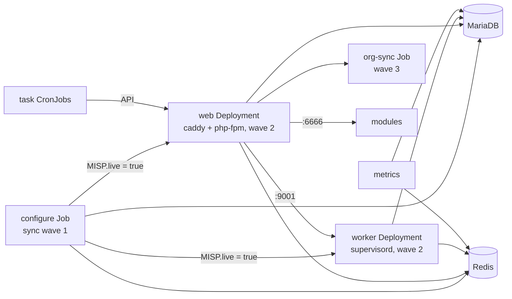

# MISP Container

A container image for [MISP](https://www.misp-project.org/) 2.5, built for Kubernetes and
usable with Compose (podman) for development.

## TL;DR

- One image, one entrypoint per role: a `configure` Job sets the database and settings up,
  then web and worker pods start and scale freely. Two small extra images: caddy and modules.
- Non-root (UID 1000), read-only root filesystem, all capabilities dropped, sessions in Redis.
- Every MISP setting has an env var (`MISP.redis_host` -> `MISP_REDIS_HOST`). Curated defaults
  live in `files/misp-config/settings.yaml`; every other setting is catalogued.
- Kubernetes: `deploy/base` is MISP itself, `deploy/components/` holds the optional parts
  (database, cache, ingress, network policies, cronjobs for all periodic work, PDBs), `deploy/overlays/prod` shows
  an overlay with KSOPS secrets.
- Compose: `cd deploy && podman compose up -d`, login `admin@admin.test` /
  `ChangeMe-Str0ng!Pass#2026` at `http://localhost:8080`.

## Images

One Dockerfile, three targets:

| Target | Image | On disk | Pull (compressed) | Purpose |
|--------|-------|---------|-------------------|---------|
| `final` | `misp-container` | 890 MB | 250 MB | PHP-FPM, workers, configure, org sync, metrics exporter, task runner, migrate; `app/files` (360 MB of lists, galaxies and geolocation data) ships in the image |
| `caddy` | `misp-container-caddy` | 76 MB | 29 MB | Static files and FastCGI reverse proxy (scratch image) |
| `modules` | `misp-container-modules` | 360 MB | 98 MB | MISP enrichment, import, export and action modules (distroless) |

Sizes are the arm64 build of MISP 2.5.47; amd64 is within a few percent.

Image tags match the MISP version (`2.5.47`, hotfixes `2.5.47-r1`). See
[DEVELOPING.md](DEVELOPING.md) for releases.

## Quick start

```bash
cd deploy
podman compose build
podman compose up -d
open http://localhost:8080
```

Default login: `admin@admin.test` / `ChangeMe-Str0ng!Pass#2026`.

## How a deployment runs



The `misp-container` image serves six roles. Every entrypoint first renders `app/Config`
from this image's MISP, `settings.yaml` and env, on every start, so a MISP upgrade reaches a
Compose config volume too. It copies the GPG key and server certificates from their Secrets,
then does its own job:

| Role | Entrypoint | Runs as | Does |
|------|------------|---------|------|
| configure | `entrypoint-configure.py` | Job, once per rollout | Schema import or migration, settings, admin user, GPG, auth plugins. Sets `MISP.live=true` last |
| web | `entrypoint-web.py` | Deployment, scalable | Waits for `MISP.live=true`, then runs PHP-FPM on 9002 behind caddy on 8080 |
| worker | `entrypoint-worker.py` | Deployment, scalable | Waits for `MISP.live=true`, then runs the `default`, `prio`, `email`, `update` and `cache` queues under supervisord |
| org-sync | `entrypoint-sync.py` | Job, after each rollout | Applies `orgs.yaml` through the API |
| metrics | `entrypoint-metrics.py` | Deployment | Prometheus exporter on 9191 |
| task | `python3 -m misp_container.task` | CronJobs (components `cronjobs`, `user-validity`) | All periodic work, see [Periodic tasks](#periodic-tasks). MISP's own scheduler never runs |

### The configure Job

The Job is the only place that touches the schema and the settings. Web and worker pods
never do, so they start in seconds and any number of them can run.

1. Refuses to run with a placeholder secret, a missing or short `SECURITY_SALT`, or an empty
   `MISP_UUID`.
2. Takes the database advisory lock `misp_configure` (a concurrent org sync waits on it).
3. Imports the engine's schema baseline (`MYSQL.sql` or `POSTGRESQL.sql`) on an empty database,
   then runs `cake Admin runUpdates`.
4. Reads every current setting once, compares with `settings.yaml`, and calls `cake` only for
   the differences: env-driven settings are enforced, defaults are written once, version-gated
   defaults once per image version.
5. Creates or updates the admin user, organisation, password and API key; configures GPG and
   the auth plugins.
6. Sets `MISP.live=true`.

The Job is idempotent: run it as often as you like.

### Startup and footprint

Measured on MISP 2.5.47 with the Compose stack on a podman machine (arm64, two cores):

| What | Time |
|------|------|
| Configure Job on an empty database: schema import, `runUpdates`, about 150 settings, admin user, GPG | 14 s |
| Configure Job on a configured instance | 1 to 3 s |
| Web or worker pod, from start to serving, once the Job has run | 1 s |
| Compose stack from `up` to the login page, images present, empty volumes | 40 s, of which MariaDB initialisation is 30 s |

Idle memory per container, after the first start:

| Container | Idle RSS | Note |
|-----------|----------|------|
| web | 36 MB | Grows with the PHP-FPM children under load (`PHP_FCGI_CHILDREN`, `PHP_MEMORY_LIMIT` per request) |
| worker | 470 MB | 21 PHP worker processes under supervisord (`NUM_WORKERS_*`) |
| modules | 145 MB | |
| metrics | 21 MB | |
| caddy | 11 MB | |
| MariaDB | 140 MB | Default buffer pool |
| Redis | 7 MB | `maxmemory` 128 MB |

The base manifests request 256 MiB for a web pod, 512 MiB for a worker pod and 256 MiB for
modules, with limits of 4 GiB, 2 GiB and 1 GiB: the requests cover the idle use above, the
limits one large event import or enrichment.

### Rollout order

Ordering does not depend on the tool that applies the manifests. The Job records the image
version it configured next to `MISP.live`, and a web or worker pod waits until both match its
own image, so a pod of a new version never serves before its migrations ran. A finished Job
removes itself after ten minutes, so the next apply or reconcile creates it again.

| Event | What happens |
|-------|--------------|
| First install | The Job imports the schema and configures MISP. Web and worker pods wait (up to 6 minutes, then restart and wait again). |
| Later rollouts | Pods of the old version keep serving. Pods of the new version wait for the new Job to record their version, then serve. |
| The Job fails | New pods keep waiting and restarting; old pods keep serving. Read the Job's log, fix the cause, apply again. |
| Nothing changed | The Job runs, finds nothing to do, and exits 0 in seconds. |
| Rollback | Apply the previous revision: its Job records its version and the pods of that version serve. A `kubectl rollout undo` alone leaves the pods waiting. |

| Tool | Notes |
|------|-------|
| Argo CD | The Jobs are Sync hooks (`configure` in wave 1, the Deployments in wave 2, `org-sync` in wave 3), recreated on every sync. The Deployments do not even roll before the Job succeeded. |
| Flux | Nothing to add. Every reconcile recreates the Job once it has removed itself; the idempotent run costs a few seconds. |
| `kubectl apply -k` | Nothing to add. A changed Job spec within ten minutes of the last run needs `kubectl delete job configure org-sync` first. |
| Compose | The `configure` service is a one-shot; `web` and `worker` depend on its completion. |

### Scaling

| Deployment | Replicas | Notes |
|------------|----------|-------|
| web | any | Sessions live in Redis; org logos and attachments are on a shared claim |
| worker | any | Redis `BRPOP` gives each job to one worker. A stopping worker gets `WORKER_STOP_GRACE` seconds (default 300) to finish; a job on a worker that dies is lost |

## Configuration

### Settings

`files/misp-config/settings.yaml` holds the defaults this image applies, grouped by where they
land. Every MISP setting has an env var derived from its name:

```
MISP.redis_host        ->  MISP_REDIS_HOST
Plugin.S3_bucket_name  ->  PLUGIN_S3_BUCKET_NAME
```

| Env var | Effect |
|---------|--------|
| set and non-empty | The value is enforced on every configure run |
| unset | The default from `settings.yaml` is written once; the setting then belongs to the MISP UI |

`files/misp-config/settings-upstream.yaml` is generated from a live MISP and lists every
setting `settings.yaml` does not name, with MISP's default and description. The image never
applies those values; the env var convention overrides any of them.

A few settings are rendered into `config.php` in every pod, because MISP reads them before
the database (Redis, supervisor, salt, encryption key, paths). Those come from the
`minimum_config` group and the same env vars.

### Essential variables

| Variable | Description |
|----------|-------------|
| `MISP_BASEURL` | Public URL of the instance |
| `ADMIN_EMAIL` | Admin email and username |
| `ADMIN_PASSWORD` | Admin password, 12 characters or more |
| `SECURITY_SALT` | Password hashing salt: 32 characters or more, identical on every replica, stable across restarts |
| `MISP_UUID` | Instance UUID for server sync: unique and stable |

```bash
python3 -c "import secrets; print(secrets.token_hex(32))"  # salt
python3 -c "import uuid; print(uuid.uuid4())"              # UUID
```

Container-level defaults (database and Redis hosts, PHP limits, worker counts) are in
`deploy/base/base.env`.

### Database

| Variable | Description |
|----------|-------------|
| `DB_ENGINE` | `mysql` (MariaDB or MySQL, the default) or `postgres` |
| `DB_HOST`, `DB_PORT` | The server; the port defaults to the engine's |
| `DB_NAME`, `DB_USER`, `DB_PASSWORD` | The database and its owner (`misp-db` holds the credentials) |
| `DB_TLS` | `true` for a TLS connection |

The `MYSQL_*` names stay as aliases of `DB_*`. On PostgreSQL the database must exist with
UTF8 encoding and be owned by the user; the configure Job loads MISP's baseline into it.
MISP's PostgreSQL support is a fresh-install path (no MySQL to PostgreSQL migration), the
On Demand correlation engine is MySQL-only, and the integration suite runs on both engines.
The image patches one line of CakePHP's PostgreSQL datasource (the `Dockerfile` names it) so
that settings inserts work. `MISP_REDIS_*` also fills the background-job and ZeroMQ Redis
settings, and `MISP_BASEURL` fills the external and REST client base URLs, unless those are
set explicitly.

### HTTPS

Caddy serves plain HTTP on 8080, for an ingress or load balancer in front. Set
`CADDY_ADDRESS` to a domain name for automatic HTTPS with Let's Encrypt instead:

```yaml
environment:
  CADDY_ADDRESS: misp.example.com
```

## Kubernetes

```
deploy/
  base/          # MISP itself: Jobs, Deployments, Services, config, attachments claim
  components/    # Optional parts an overlay opts into
  overlays/
    prod/        # Overlay with KSOPS secrets and every component
```

| Component | Content | Leave it out when |
|-----------|---------|-------------------|
| `mariadb` | MariaDB StatefulSet with a 20Gi PVC | You use `postgres` or an external database (`DB_HOST`) |
| `postgres` | PostgreSQL 17 StatefulSet with a 20Gi PVC | You use `mariadb` or an external database |
| `redis` | Deployment without persistence | You run an external Redis (`MISP_REDIS_HOST`) |
| `ingress-haproxy` | Ingress for the haproxy class | Another ingress or a Gateway routes to the `web` Service |
| `netpol-cilium` | CiliumNetworkPolicies for every pod | The cluster does not run Cilium |
| `cronjobs` | The periodic task CronJobs, see [Periodic tasks](#periodic-tasks) | You want no periodic work |
| `user-validity` | A daily check of every account against the OIDC or LDAP identity provider | Neither the `oidc` nor the `ldap` group is enabled |
| `housekeeping` | Nightly deletes in `jobs`, `logs`, `audit_logs` (`HOUSEKEEPING_<TABLE>_DAYS`) | Retention is handled elsewhere |
| `pdb` | PodDisruptionBudgets for web and worker | One replica of each |
| `migrate` | One-off Job copying an existing MySQL/MariaDB MISP into the database, see [docs/migration.md](docs/migration.md) | Always, once the Job has run |

An overlay lists the base, the components it wants, and its own values:

```yaml
# your-overlay/kustomization.yaml
resources:
  - ../../base
components:
  - ../../components/mariadb
  - ../../components/redis
  - ../../components/ingress-haproxy
configMapGenerator:
  - name: misp-env
    behavior: merge
    literals:
      - MISP_BASEURL=https://misp.example.com
      - ADMIN_EMAIL=admin@example.com
```

### Secrets

Three Secrets follow their consumers; the base generates them from `.env` files that Compose
reads too:

| Secret | File | Keys | Who gets it |
|--------|------|------|-------------|
| `misp-db` | `secrets-db.env` | `DB_USER`, `DB_PASSWORD`, `MYSQL_ROOT_PASSWORD` (mariadb only) | configure, web, worker, org-sync, housekeeping, console task CronJobs, the mariadb or postgres component; metrics gets user and password only |
| `misp-app` | `secrets-app.env` | `MISP_REDIS_PASSWORD`, `GNUPG_PASSWORD`, `SECURITY_ENCRYPTION_KEY`, `SECURITY_SALT` | configure, web, worker, redis, console task CronJobs; metrics gets `MISP_REDIS_PASSWORD` only |
| `misp-admin` | `secrets-admin.env` | `ADMIN_PASSWORD`, `ADMIN_KEY` | configure, org-sync, cronjobs. With `ADMIN_KEY` empty MISP generates a key, org-sync exits without changes, and the cronjobs fail with a clear message |
| `misp-migrate` | `components/migrate/secrets-migrate.env` | `MIGRATE_SOURCE_*`, `MIGRATE_FORCE`, `MIGRATE_REPLACE_COPY` | The migrate Job only |

The base files hold placeholders that the configure Job refuses. Supply the real Secrets
from your overlay through KSOPS, as `deploy/overlays/prod` does: an encrypted
`secrets.sops.yaml` with the three Secrets and `kustomize.config.k8s.io/behavior: replace`.
Kustomize's `secretGenerator` cannot decrypt, so do not encrypt the `.env` files in place.

Two more Secrets are optional and copied into every pod at start:

| Secret | Content | Command |
|--------|---------|---------|
| `misp-gnupg` | `private.asc`, the instance GPG key (armoured secret key export). `GNUPG_PASSWORD` is its passphrase; set `GNUPG_SIGN=true` once it exists | `kubectl -n misp create secret generic misp-gnupg --from-file=private.asc` |
| `misp-certs` | `<server id>.pem` files for sync servers that need a pinned certificate | `kubectl -n misp create secret generic misp-certs --from-file=3.pem` |

```bash
gpg --batch --passphrase "$GNUPG_PASSWORD" --quick-generate-key "MISP Admin <misp@example.com>" rsa3072 sign never
gpg --armor --export-secret-keys misp@example.com > private.asc
```

### Storage

| Resource | Base default | Notes |
|----------|--------------|-------|
| MariaDB or PostgreSQL | StatefulSet, 20Gi ReadWriteOnce PVC (`mariadb` or `postgres` component) | Patch the size or storage class in the overlay |
| Attachments, org logos, custom images | PVC `attachments`, 20Gi ReadWriteMany | Web and worker pods share it. For S3, set `PLUGIN_S3_BUCKET_NAME` and remove the claim in the overlay |
| Redis | No persistence (`redis` component) | Sessions and queued jobs are lost when Redis restarts |
| Everything else | `emptyDir` per pod | `app/Config`, `app/tmp`, `.gnupg`, `app/files/{scripts/tmp,certs,terms}` |

The web and worker entrypoints refuse to start when the attachments directory is not
writable and S3 is not configured. A sync server certificate uploaded through the UI lands
on one replica only; use the `misp-certs` Secret.

### Network policies

The `netpol-cilium` component allows only the paths in the diagram above plus DNS, HTTPS to
the outside for web, worker, modules, metrics and the console tasks, and SMTP (ports 25, 465
and 587, in or outside the cluster) for web, worker and the console tasks. A mail relay on
another port needs a patch. The ingress controller namespace
(`haproxy-controller`) and the Prometheus namespace (`monitoring`) are its patch points. The
file header of `deploy/components/netpol-cilium/networkpolicy.yaml` lists every flow.

### Periodic tasks

The task runner in the main image does all periodic work. MISP's own scheduler
(`scheduler_worker`) never runs, so a task enabled under MISP's Scheduled tasks page runs
nowhere; `misp_scheduled_tasks_enabled` counts them (see [docs/metrics.md](docs/metrics.md)).
Manual actions in the UI and the API, such as a pull, a push or fetching one event from a
remote server, do not use a scheduler: the workers run them.

| Task | Does | Kind | CronJob schedule |
|------|------|------|------------------|
| `pull-servers` | Pull from every server with pull enabled | API | every 5 minutes |
| `push-servers` | Push to every server with push enabled | API | every 15 minutes |
| `cache-servers` | Cache the events of every server | API | 02:40 |
| `fetch-feeds` | Fetch every enabled feed | API | 02:30 |
| `cache-feeds` | Cache every feed | API | 02:20 |
| `push-taxii` | Push to every enabled TAXII server | API | hourly |
| `sharing-group-blueprints` | Apply the sharing group blueprints | API | hourly |
| `update-galaxies`, `update-taxonomies`, `update-warninglists`, `update-noticelists`, `update-object-templates` | Update MISP's bundled definitions | API | 03:00 to 03:40 |
| `periodic-summary` | Send the daily, weekly (Mondays) and monthly (the first) summaries users subscribed to | console | 06:00, no retry |
| `check-user-validity` | Report every account as valid or invalid at the OIDC or LDAP provider | console | 05:30 (`user-validity` component) |
| `block-invalid-users` | Disable the accounts the provider no longer backs | console | patch `user-validity` to it |
| `workflow <id>` | Run one ad-hoc workflow | API | an overlay adds the CronJob |

API tasks call the MISP API with `ADMIN_KEY`, which must be set. Before dispatching, a run
reads the queue depth (`misp_jobs_queued`, which the metrics exporter reads from MISP's job
queues in Redis) and dispatches nothing while `TASK_MAX_QUEUED` jobs (default 200) or more
are waiting or running, so a slow worker pool does not pile up work. An unreachable exporter
or Redis does not block dispatch. A partner that refuses a pull or push is logged and shows
in the metrics; a run exits 1 only when no call succeeded.

Console tasks have no API. The pod renders `app/Config` and runs MISP's console, with the
configure Job's volumes and the `misp-db` and `misp-app` Secrets. The periodic summary
needs a mail relay (`SMTP_FQDN`, `SMTP_PORT`).

Every task CronJob pod carries `app.kubernetes.io/component: misp-task` (API) or
`misp-console-task` (console); the network policies select on that label. A CronJob an
overlay adds, for one server or one workflow, copies a CronJob of its kind and keeps the
label. To disable users instead of reporting them:

```yaml
# overlay: with the user-validity component
patches:
  - target: {kind: CronJob, name: user-validity}
    patch: |-
      - op: replace
        path: /spec/jobTemplate/spec/template/spec/containers/0/command/5
        value: block-invalid-users
```

On demand:

```bash
kubectl -n misp create job --from=cronjob/pull-servers pull-now
podman compose run --rm --no-deps sync python3 -m misp_container.task pull-servers   # Compose, API task
podman compose exec worker python3 -m misp_container.task periodic-summary          # Compose, console task
```

## Compose

`deploy/docker-compose.yml` is the single-host development stack: the same images and
entrypoints, named volumes instead of claims, `AUTOCONF_GPG=true` (a key generated on first
start), and no CronJobs: run periodic tasks on demand (see [Periodic tasks](#periodic-tasks)). Values come
from `deploy/base/*.env` with `deploy/compose.env` and `deploy/compose-secrets.env` on top.
`MISP_IMAGE_TAG` selects the image tag.

## Declarative org sync

`orgs.yaml` describes organisations, users, roles, servers, tags, taxonomies, warninglists
and sharing groups. The org-sync run is idempotent, expands `${VAR}` in authkeys and URLs,
and takes the configure lock. See `deploy/orgs.yaml.example`.

```yaml
teams:
  - name: "CERT-Example"
    uuid: "2399b00e-b7f4-4fdb-aeb9-03d28e83a210"
    sector: "Government"
    users:
      - email: analyst@example.com
        role: User
      - email: sync@partner.com
        role: Sync user
        authkey: "${PARTNER_SYNC_KEY}"
    servers:
      - name: "Partner MISP"
        url: "https://misp.partner.com"
        authkey: "${PARTNER_AUTHKEY}"
        pull: true
        push: false
        pull_rules:
          tags: ["tlp:clear", "tlp:green"]

tags:
  - name: "release-to:partners"
    colour: "#0088cc"

taxonomies:
  - tlp
  - admiralty-scale
```

| Where | How the file gets in |
|-------|----------------------|
| Kubernetes | Replace the `misp-orgs` ConfigMap in your overlay: `configMapGenerator: - name: misp-orgs, behavior: replace, files: [orgs.yaml=orgs.yaml]` |
| Compose | Mount it at `/etc/misp-docker/orgs.yaml` on the `sync` service |

| Variable | Description |
|----------|-------------|
| `ORG_CONFIG_FILE` | Path of the file (default `/etc/misp-docker/orgs.yaml`) |
| `ORG_CONFIG_URL` | URL to fetch the file from instead |
| `ADMIN_KEY` | Admin API key (required) |
| `SYNC_BASE_URL` | MISP URL the run connects to (default `MISP_BASEURL`) |

## Authentication plugins

MISP's auth plugins read their configuration from `config.php`, so their settings are groups
in `settings.yaml` that every pod renders when the plugin's switch is on. The documented
short names below are aliases of the derived ones (`OidcAuth.provider_url` is
`OIDCAUTH_PROVIDER_URL` as well).

| Switch | Group | Plugin |
|--------|-------|--------|
| `OIDC_ENABLE=true` | `oidc` | `OidcAuth`: OpenID Connect |
| `LDAPAUTH_ENABLE=true` | `ldap` | `LdapAuth`: LDAP bind with a reader account |
| `APACHESECUREAUTH_LDAP_ENABLE=true` | `apache_auth` | `ApacheSecureAuth`: a header from the proxy, looked up in LDAP |
| `CUSTOM_AUTH_ENABLE=true` | (database) | `Plugin.CustomAuth_*`: a header from the proxy, no lookup |

### OpenID Connect

| Variable | Setting | Default |
|----------|---------|---------|
| `OIDC_PROVIDER_URL` | `OidcAuth.provider_url` | required |
| `OIDC_CLIENT_ID`, `OIDC_CLIENT_SECRET` | `OidcAuth.client_id`, `client_secret` | required; the secret belongs in `misp-app` |
| `OIDC_ISSUER` | `OidcAuth.issuer` | the provider URL |
| `OIDC_ROLES_PROPERTY` | `OidcAuth.roles_property` | `roles`: the claim with the user's roles |
| `OIDC_ROLES_MAPPING` | `OidcAuth.role_mapper` | `{}`: JSON, IdP role to MISP role id or name, first match wins. A user with no matching role is refused |
| `OIDC_DEFAULT_ORG` | `OidcAuth.default_org` | organisation id, UUID or name when the IdP sends none |
| `OIDC_SCOPES` | `OidcAuth.scopes` | `profile,email` |
| `OIDC_MIXEDAUTH` | `OidcAuth.mixedAuth` | `false`: every login goes to the IdP. `true` keeps the password form and adds a button |
| `OIDC_LOGOUT_URL` | `Plugin.CustomAuth_custom_logout` | the IdP's logout URL |
| `OIDC_AUTH_METHOD`, `OIDC_CODE_CHALLENGE_METHOD` | `authentication_method`, `code_challenge_method` | `client_secret_post`, `S256` |

The redirect URI is `MISP_BASEURL/users/login`; register it at the IdP. Every other
`OidcAuth.*` key in `settings.yaml` (offline access, user validity checks, email linking)
takes its derived env var. The integration suite logs in through a dex instance with a role
mapped by name and the default organisation.

### LDAP

`LDAPAUTH_LDAPSERVER`, `LDAPAUTH_LDAPDN`, `LDAPAUTH_LDAPREADERUSER`, `LDAPAUTH_LDAPREADERPASSWORD`
are required; `LDAPAUTH_LDAPSEARCHFILTER`, `LDAPAUTH_LDAPDEFAULTORGID`, `LDAPAUTH_LDAPDEFAULTROLEID`,
`LDAPAUTH_LDAPROLEFIELD` and the rest of the `ldap` group follow the plugin's README.

## Custom scripts

Two hook points for custom Python, mounted as files, skipped when absent:

| Script | Where | When |
|--------|-------|------|
| `/custom/setup.py` | configure Job | After the database is ready, before configuration |
| `/custom/pre-start.py` | every web replica | Before PHP-FPM starts |

## Logging

Every pod writes its log to stdout and stderr and keeps no log file. `LOG_FORMAT` selects the
line format: `json` (the base default: one JSON object per line, for a log collector) or
`text` (the Compose default, coloured on a terminal).

| Source | Reaches the output as | Format |
|--------|-----------------------|--------|
| The entrypoints, the configure Job, org sync, tasks, metrics | `time`, `level`, `context`, `message` (and `exception`) | `LOG_FORMAT` |
| MISP's own log (CakeLog: job starts and ends, exceptions, warnings) | the same fields, `context` `misp` | `LOG_FORMAT` |
| Files MISP appends to directly (`server-sync.log`, `workflow-execution.log`, `exec-errors.log`, `kafka.error.log`) | one line per file line, `context` `misp:<file>`; a file is emptied past 10 MB | `LOG_FORMAT` |
| PHP errors and warnings in web pods | PHP's own line, through PHP-FPM | text |
| PHP-FPM itself | FPM's own line | text |
| Caddy access log | Caddy's own JSON | JSON |

## Metrics

The metrics Deployment exposes Prometheus metrics on port 9191: instance health, content
counts, sync server status and certificate expiry, job queues, and the outcome of configure
and org-sync runs. See
[docs/metrics.md](docs/metrics.md) for the reference and example alerts.

## Migration

The migrate Job (`migrate` component, Compose profile `migrate`) copies an existing MySQL
or MariaDB MISP database into this deployment, on either engine, and the attachments from a
mounted directory or an S3 bucket into the deployment's bucket or attachments volume; the
configure Job then upgrades the copy. See
[docs/migration.md](docs/migration.md).

## Development

See [DEVELOPING.md](DEVELOPING.md) for the settings engine, the tests, new MISP releases and
the release process.
[AGENTS.md](AGENTS.md) maps the tree for agents; it is generated from the tree (`mise run agents-md`).
