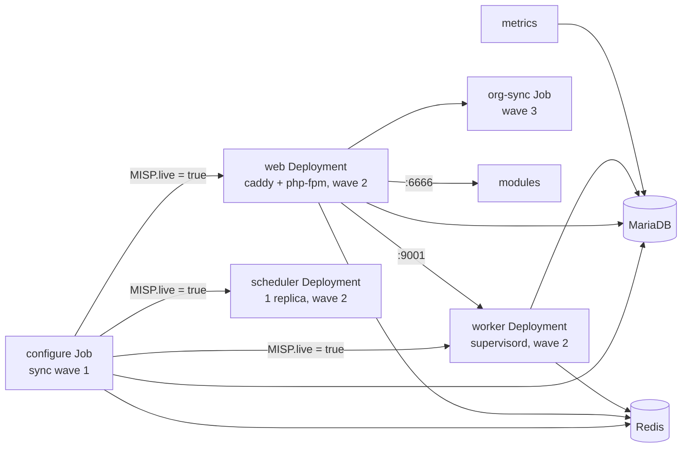

# MISP Container

A container image for [MISP](https://www.misp-project.org/) 2.5, built for Kubernetes and
usable with Compose (podman) for development.

## TL;DR

- One image, one entrypoint per role: a `configure` Job sets the database and settings up,
  then web and worker pods start and scale freely. Two small extra images: caddy and modules.
- Non-root (UID 1000), read-only root filesystem, all capabilities dropped, sessions in Redis.
- Every MISP setting has an env var (`MISP.redis_host` -> `MISP_REDIS_HOST`). Curated defaults
  live in `files/misp-config/settings.yaml`; every other setting is catalogued.
- Kubernetes: `deploy/base` is MISP itself, `deploy/components/` holds the optional parts
  (database, cache, ingress, network policies, cronjobs, PDBs), `deploy/overlays/prod` shows
  an overlay with KSOPS secrets.
- Compose: `cd deploy && podman compose up -d`, login `admin@admin.test` /
  `ChangeMe-Str0ng!Pass#2026` at `http://localhost:8080`.

## Images

One Dockerfile, three targets:

| Target | Image | Size | Purpose |
|--------|-------|------|---------|
| `final` | `misp-container` | ~900 MB | PHP-FPM, workers, configure, org sync, metrics exporter; `app/files` (360 MB of lists, galaxies and geolocation data) ships in the image |
| `caddy` | `misp-container-caddy` | ~64 MB | Static files and FastCGI reverse proxy (scratch image) |
| `modules` | `misp-container-modules` | ~296 MB | MISP enrichment, import, export and action modules (distroless) |

Image tags match the MISP version (`2.5.47`, hotfixes `2.5.47-r1`). See
[DEVELOPING.md](DEVELOPING.md) for releases.

## Quick start

```bash
cd deploy
podman compose build
podman compose up -d
open http://localhost:8080
```

Default login: `admin@admin.test` / `ChangeMe-Str0ng!Pass#2026`.

## How a deployment runs



The `misp-container` image serves six roles. Every entrypoint first renders `app/Config`
from `settings.yaml` and env, copies the GPG key and server certificates from their Secrets,
then does its own job:

| Role | Entrypoint | Runs as | Does |
|------|------------|---------|------|
| configure | `entrypoint-configure.py` | Job, once per rollout | Schema import or migration, settings, admin user, GPG, auth plugins. Sets `MISP.live=true` last |
| web | `entrypoint-web.py` | Deployment, scalable | Waits for `MISP.live=true`, then runs PHP-FPM on 9002 behind caddy on 8080 |
| worker | `entrypoint-worker.py` | Deployment, scalable | Waits for `MISP.live=true`, then runs the `default`, `prio`, `email`, `update` and `cache` queues under supervisord |
| scheduler | `entrypoint-worker.py` | Deployment, 1 replica | Runs MISP's `scheduler_worker` only, for MISP-internal scheduling (workflows) |
| org-sync | `entrypoint-sync.py` | Job, after each rollout | Applies `orgs.yaml` through the API |
| metrics | `entrypoint-metrics.py` | Deployment | Prometheus exporter on 9191 |

### The configure Job

The Job is the only place that touches the schema and the settings. Web and worker pods
never do, so they start in seconds and any number of them can run.

1. Refuses to run with a placeholder secret, a missing or short `SECURITY_SALT`, or an empty
   `MISP_UUID`.
2. Takes the MySQL advisory lock `misp_configure` (a concurrent org sync waits on it).
3. Imports `MYSQL.sql` on an empty database, then runs `cake Admin runUpdates` and the
   performance indexes.
4. Reads every current setting once, compares with `settings.yaml`, and calls `cake` only for
   the differences: env-driven settings are enforced, defaults are written once, version-gated
   defaults once per image version.
5. Creates or updates the admin user, organisation, password and API key; configures GPG and
   the auth plugins.
6. Sets `MISP.live=true`.

A run on an already configured instance takes seconds. The Job is idempotent: run it as often
as you like.

### Rollout order

| Event | What happens |
|-------|--------------|
| First install | The Job imports the schema and configures MISP. Web and worker pods wait for `MISP.live=true` (up to 6 minutes, then restart and wait again). |
| Later rollouts | The Job runs migrations and setting changes for the new image. `MISP.live` is already true, so pods of the old version keep serving until the new ones replace them. |
| The Job fails | With Argo CD the sync stops in wave 1: the Deployments stay on the old version. Read the Job's log, fix the cause, sync again. |
| Nothing changed | The Job runs, finds nothing to do, and exits 0. |

The Jobs carry Argo CD annotations: `configure` is a Sync hook in wave 1, the Deployments
are wave 2, `org-sync` is a Sync hook in wave 3, and both Jobs are recreated on every sync
(`BeforeHookCreation`). With plain `kubectl apply`, a finished Job blocks a changed spec:

```bash
kubectl delete job configure org-sync
kubectl apply -k your-overlay
```

Compose runs the same sequence: the `configure` service is a one-shot, and `web` and
`worker` depend on its completion.

### Scaling

| Deployment | Replicas | Notes |
|------------|----------|-------|
| web | any | Sessions live in Redis; org logos and attachments are on a shared claim |
| worker | any | Redis `BRPOP` gives each job to one worker. A stopping worker gets `WORKER_STOP_GRACE` seconds (default 300) to finish; a job on a worker that dies is lost |
| scheduler | 1 | Two schedulers run everything twice. Periodic tasks belong to the `cronjobs` component; do not also enable them under MISP's Scheduled tasks |

## Configuration

### Settings

`files/misp-config/settings.yaml` holds the defaults this image applies, grouped by where they
land. Every MISP setting has an env var derived from its name:

```
MISP.redis_host        ->  MISP_REDIS_HOST
Plugin.S3_bucket_name  ->  PLUGIN_S3_BUCKET_NAME
```

| Env var | Effect |
|---------|--------|
| set and non-empty | The value is enforced on every configure run |
| unset | The default from `settings.yaml` is written once; the setting then belongs to the MISP UI |

`files/misp-config/settings-upstream.yaml` is generated from a live MISP and lists every
setting `settings.yaml` does not name, with MISP's default and description. The image never
applies those values; the env var convention overrides any of them.

A few settings are rendered into `config.php` in every pod, because MISP reads them before
the database (Redis, supervisor, salt, encryption key, paths). Those come from the
`minimum_config` group and the same env vars.

### Essential variables

| Variable | Description |
|----------|-------------|
| `MISP_BASEURL` | Public URL of the instance |
| `ADMIN_EMAIL` | Admin email and username |
| `ADMIN_PASSWORD` | Admin password, 12 characters or more |
| `SECURITY_SALT` | Password hashing salt: 32 characters or more, identical on every replica, stable across restarts |
| `MISP_UUID` | Instance UUID for server sync: unique and stable |

```bash
python3 -c "import secrets; print(secrets.token_hex(32))"  # salt
python3 -c "import uuid; print(uuid.uuid4())"              # UUID
```

Container-level defaults (database and Redis hosts, PHP limits, worker counts) are in
`deploy/base/base.env`. `MISP_REDIS_*` also fills the background-job and ZeroMQ Redis
settings, and `MISP_BASEURL` fills the external and REST client base URLs, unless those are
set explicitly.

### HTTPS

Caddy serves plain HTTP on 8080, for an ingress or load balancer in front. Set
`CADDY_ADDRESS` to a domain name for automatic HTTPS with Let's Encrypt instead:

```yaml
environment:
  CADDY_ADDRESS: misp.example.com
```

## Kubernetes

```
deploy/
  base/          # MISP itself: Jobs, Deployments, Services, config, attachments claim
  components/    # Optional parts an overlay opts into
  overlays/
    prod/        # Overlay with KSOPS secrets and every component
```

| Component | Content | Leave it out when |
|-----------|---------|-------------------|
| `mariadb` | StatefulSet with a 20Gi PVC | You run an external database (`MYSQL_HOST`) |
| `redis` | Deployment without persistence | You run an external Redis (`MISP_REDIS_HOST`) |
| `ingress-haproxy` | Ingress for the haproxy class | Another ingress or a Gateway routes to the `web` Service |
| `netpol-cilium` | CiliumNetworkPolicies for every pod | The cluster does not run Cilium |
| `cronjobs` | Feed, sync and update CronJobs through the API | The MISP scheduler runs these tasks |
| `housekeeping` | Nightly deletes in `jobs`, `logs`, `audit_logs` | Retention is handled elsewhere |
| `pdb` | PodDisruptionBudgets for web and worker | One replica of each |

An overlay lists the base, the components it wants, and its own values:

```yaml
# your-overlay/kustomization.yaml
resources:
  - ../../base
components:
  - ../../components/mariadb
  - ../../components/redis
  - ../../components/ingress-haproxy
configMapGenerator:
  - name: misp-env
    behavior: merge
    literals:
      - MISP_BASEURL=https://misp.example.com
      - ADMIN_EMAIL=admin@example.com
```

### Secrets

Three Secrets follow their consumers; the base generates them from `.env` files that Compose
reads too:

| Secret | File | Keys | Who gets it |
|--------|------|------|-------------|
| `misp-db` | `secrets-db.env` | `MYSQL_USER`, `MYSQL_PASSWORD`, `MYSQL_ROOT_PASSWORD` | configure, web, worker, scheduler, org-sync, mariadb, housekeeping; metrics gets user and password only |
| `misp-app` | `secrets-app.env` | `MISP_REDIS_PASSWORD`, `GNUPG_PASSWORD`, `SECURITY_ENCRYPTION_KEY`, `SECURITY_SALT` | configure, web, worker, scheduler, redis |
| `misp-admin` | `secrets-admin.env` | `ADMIN_PASSWORD`, `ADMIN_KEY` | configure, org-sync, cronjobs. With `ADMIN_KEY` empty MISP generates a key, org-sync exits without changes, and the cronjobs fail with a clear message |

The base files hold placeholders that the configure Job refuses. Supply the real Secrets
from your overlay through KSOPS, as `deploy/overlays/prod` does: an encrypted
`secrets.sops.yaml` with the three Secrets and `kustomize.config.k8s.io/behavior: replace`.
Kustomize's `secretGenerator` cannot decrypt, so do not encrypt the `.env` files in place.

Two more Secrets are optional and copied into every pod at start:

| Secret | Content | Command |
|--------|---------|---------|
| `misp-gnupg` | `private.asc`, the instance GPG key (armoured secret key export). `GNUPG_PASSWORD` is its passphrase; set `GNUPG_SIGN=true` once it exists | `kubectl -n misp create secret generic misp-gnupg --from-file=private.asc` |
| `misp-certs` | `<server id>.pem` files for sync servers that need a pinned certificate | `kubectl -n misp create secret generic misp-certs --from-file=3.pem` |

```bash
gpg --batch --passphrase "$GNUPG_PASSWORD" --quick-generate-key "MISP Admin <misp@example.com>" rsa3072 sign never
gpg --armor --export-secret-keys misp@example.com > private.asc
```

### Storage

| Resource | Base default | Notes |
|----------|--------------|-------|
| MariaDB | StatefulSet, 20Gi ReadWriteOnce PVC (`mariadb` component) | Patch the size or storage class in the overlay |
| Attachments, org logos, custom images | PVC `attachments`, 20Gi ReadWriteMany | Web and worker pods share it. For S3, set `PLUGIN_S3_BUCKET_NAME` and remove the claim in the overlay |
| Redis | No persistence (`redis` component) | Sessions and queued jobs are lost when Redis restarts |
| Everything else | `emptyDir` per pod | `app/Config`, `app/tmp`, `.gnupg`, `app/files/{scripts/tmp,certs,terms}` |

The web and worker entrypoints refuse to start when the attachments directory is not
writable and S3 is not configured. A sync server certificate uploaded through the UI lands
on one replica only; use the `misp-certs` Secret.

### Network policies

The `netpol-cilium` component allows only the paths in the diagram above plus DNS and, for
modules and metrics, HTTPS to the outside. The ingress controller namespace
(`haproxy-controller`) and the Prometheus namespace (`monitoring`) are its patch points. The
file header of `deploy/components/netpol-cilium/networkpolicy.yaml` lists every flow.

### Periodic tasks

The task runner in the main image calls the MISP API for the periodic work:
`cache-feeds`, `fetch-feeds`, `pull-servers`, `push-servers`, `update-galaxies`,
`update-taxonomies`, `update-warninglists`, `update-noticelists`. The `cronjobs` component
schedules them; `ADMIN_KEY` must be set. A partner that refuses a pull or push is logged and
shows in the metrics; a run exits 1 only when no call succeeded. On demand:

```bash
kubectl -n misp create job --from=cronjob/pull-servers pull-now
podman compose run --rm --no-deps sync python3 -m misp_container.task pull-servers   # Compose
```

## Compose

`deploy/docker-compose.yml` is the single-host development stack: the same images and
entrypoints, named volumes instead of claims, `AUTOCONF_GPG=true` (a key generated on first
start), the scheduler inside the worker container, and no housekeeping CronJobs. Values come
from `deploy/base/*.env` with `deploy/compose.env` and `deploy/compose-secrets.env` on top.
`MISP_IMAGE_TAG` selects the image tag.

## Declarative org sync

`orgs.yaml` describes organisations, users, roles, servers, tags, taxonomies, warninglists
and sharing groups. The org-sync run is idempotent, expands `${VAR}` in authkeys and URLs,
and takes the configure lock. See `deploy/orgs.yaml.example`.

```yaml
teams:
  - name: "CERT-Example"
    uuid: "2399b00e-b7f4-4fdb-aeb9-03d28e83a210"
    sector: "Government"
    users:
      - email: analyst@example.com
        role: User
      - email: sync@partner.com
        role: Sync user
        authkey: "${PARTNER_SYNC_KEY}"
    servers:
      - name: "Partner MISP"
        url: "https://misp.partner.com"
        authkey: "${PARTNER_AUTHKEY}"
        pull: true
        push: false
        pull_rules:
          tags: ["tlp:clear", "tlp:green"]

tags:
  - name: "release-to:partners"
    colour: "#0088cc"

taxonomies:
  - tlp
  - admiralty-scale
```

| Where | How the file gets in |
|-------|----------------------|
| Kubernetes | Replace the `misp-orgs` ConfigMap in your overlay: `configMapGenerator: - name: misp-orgs, behavior: replace, files: [orgs.yaml=orgs.yaml]` |
| Compose | Mount it at `/etc/misp-docker/orgs.yaml` on the `sync` service |

| Variable | Description |
|----------|-------------|
| `ORG_CONFIG_FILE` | Path of the file (default `/etc/misp-docker/orgs.yaml`) |
| `ORG_CONFIG_URL` | URL to fetch the file from instead |
| `ADMIN_KEY` | Admin API key (required) |
| `SYNC_BASE_URL` | MISP URL the run connects to (default `MISP_BASEURL`) |

## Custom scripts

Two hook points for custom Python, mounted as files, skipped when absent:

| Script | Where | When |
|--------|-------|------|
| `/custom/setup.py` | configure Job | After the database is ready, before configuration |
| `/custom/pre-start.py` | every web replica | Before PHP-FPM starts |

## Metrics

The metrics Deployment exposes Prometheus metrics on port 9191: instance health, content
counts, sync server status and certificate expiry, job queues, org sync runs. See
[docs/metrics.md](docs/metrics.md) for the reference and example alerts.

## Migration

See [docs/migration.md](docs/migration.md) for moving an existing MISP instance onto this
system.

## Development

See [DEVELOPING.md](DEVELOPING.md) for the settings engine, the tests, new MISP releases and
the release process.
