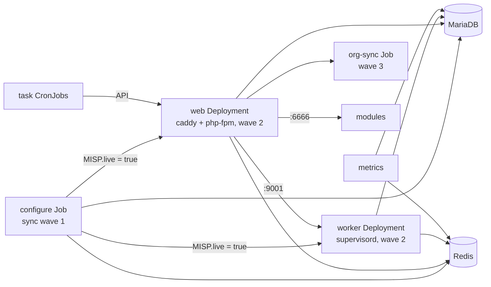

# Architecture

## TL;DR

- The `configure` Job is the only place that touches the schema and the settings; web and
  worker pods wait for it and then start in seconds, in any number.
- A pod of a new image version serves only once the Job has configured that version, whatever
  tool applies the manifests.
- Web and worker scale freely: sessions live in Redis, attachments on a shared claim or S3.

## Roles

The `misp-container` image serves six roles. Every entrypoint first renders `app/Config`
from this image's MISP, `settings.yaml` and env, on every start, so a MISP upgrade reaches a
Compose config volume too. It copies the GPG key and server certificates from their Secrets,
then does its own job:

| Role | Entrypoint | Runs as | Does |
|------|------------|---------|------|
| configure | `entrypoint-configure.py` | Job, once per rollout | Schema import or migration, settings, admin user, GPG, auth plugins. Sets `MISP.live=true` last |
| web | `entrypoint-web.py` | Deployment, scalable | Waits for `MISP.live=true`, then runs PHP-FPM on 9002 behind caddy on 8080 |
| worker | `entrypoint-worker.py` | Deployment, scalable | Waits for `MISP.live=true`, then runs the `default`, `prio`, `email`, `update` and `cache` queues under supervisord |
| org-sync | `entrypoint-sync.py` | Job, after each rollout | Applies `orgs.yaml` through the API |
| metrics | `entrypoint-metrics.py` | Deployment | Prometheus exporter on 9191 |
| task | `python3 -m misp_container.task` | CronJobs (components `cronjobs`, `user-validity`) | All periodic work, see [Periodic tasks](kubernetes.md#periodic-tasks). MISP's own scheduler never runs |

## The configure Job

The Job is the only place that touches the schema and the settings. Web and worker pods
never do, so they start in seconds and any number of them can run.

1. Refuses to run with a placeholder secret, a missing or short `SECURITY_SALT`, or an empty
   `MISP_UUID`.
2. Takes the database advisory lock `misp_configure` (a concurrent org sync waits on it).
3. Imports the engine's schema baseline (`MYSQL.sql` or `POSTGRESQL.sql`) on an empty database,
   then runs `cake Admin runUpdates`.
4. Reads every current setting once, compares with `settings.yaml`, and calls `cake` only for
   the differences: env-driven settings are enforced, defaults are written once, version-gated
   defaults once per image version.
5. Creates or updates the admin user, organisation, password and API key; configures GPG and
   the auth plugins.
6. Sets `MISP.live=true`.

The Job is idempotent: run it as often as you like.

## Startup and footprint

Measured on MISP 2.5.47 with the Compose stack on a podman machine (arm64, two cores):

| What | Time |
|------|------|
| Configure Job on an empty database: schema import, `runUpdates`, about 150 settings, admin user, GPG | 14 s |
| Configure Job on a configured instance | 1 to 3 s |
| Web or worker pod, from start to serving, once the Job has run | 1 s |
| Compose stack from `up` to the login page, images present, empty volumes | 40 s, of which MariaDB initialisation is 30 s |

Idle memory per container, after the first start:

| Container | Idle RSS | Note |
|-----------|----------|------|
| web | 36 MB | Grows with the PHP-FPM children under load (`PHP_FCGI_CHILDREN`, `PHP_MEMORY_LIMIT` per request) |
| worker | 470 MB | 21 PHP worker processes under supervisord (`NUM_WORKERS_*`) |
| modules | 145 MB | |
| metrics | 21 MB | |
| caddy | 11 MB | |
| MariaDB | 140 MB | Default buffer pool |
| Redis | 7 MB | `maxmemory` 128 MB |

The base manifests request 256 MiB for PHP-FPM in a web pod, 512 MiB for a worker pod and
256 MiB for modules, with limits of 4 GiB, 2 GiB and 1 GiB: the requests cover the idle use above, the
limits one large event import or enrichment.

## Rollout order

Ordering does not depend on the tool that applies the manifests. The Job records the image
version it configured next to `MISP.live`, and a web or worker pod waits until both match its
own image, so a pod of a new version never serves before its migrations ran. A finished Job
removes itself after ten minutes, so the next apply or reconcile creates it again.

| Event | What happens |
|-------|--------------|
| First install | The Job imports the schema and configures MISP. Web and worker pods wait (up to 6 minutes, then restart and wait again). |
| Later rollouts | Pods of the old version keep serving. Pods of the new version wait for the new Job to record their version, then serve. |
| The Job fails | New pods keep waiting and restarting; old pods keep serving. Read the Job's log, fix the cause, apply again. |
| Nothing changed | The Job runs, finds nothing to do, and exits 0 in seconds. |
| Rollback | Apply the previous revision: its Job records its version and the pods of that version serve. A `kubectl rollout undo` alone leaves the pods waiting. |

| Tool | Notes |
|------|-------|
| Argo CD | The Jobs are Sync hooks (`configure` in wave 1, the Deployments in wave 2, `org-sync` in wave 3), recreated on every sync. The Deployments do not even roll before the Job succeeded. |
| Flux | Nothing to add. Every reconcile recreates the Job once it has removed itself; the idempotent run costs a few seconds. |
| `kubectl apply -k` | Nothing to add. A changed Job spec within ten minutes of the last run needs `kubectl delete job configure org-sync` first. |
| Compose | The `configure` service is a one-shot; `web` and `worker` depend on its completion. |

## Scaling

| Deployment | Replicas | Notes |
|------------|----------|-------|
| web | any | Sessions live in Redis; org logos and attachments are on a shared claim |
| worker | any | Redis `BRPOP` gives each job to one worker. A stopping worker gets `WORKER_STOP_GRACE` seconds (default 300) to finish; a job on a worker that dies is lost |
