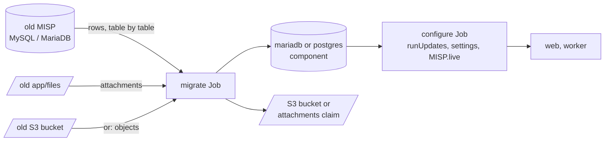

# Migrating an existing MISP instance

The migrate Job copies an existing MISP database (MySQL or MariaDB: the official misp-docker,
a VM, a bare-metal install) into this deployment, on the `mariadb` or the `postgres` component,
and copies the attachments into this deployment's store: its S3 bucket, or the attachments
volume. The configure Job then upgrades and configures the copy as on any release upgrade.

## TL;DR

1. Read `Security.salt`, `Security.encryption_key` and `MISP.uuid` from the old instance
   (`config.php` or `system_settings`) into `misp-app` and `misp-env` (Compose:
   `compose-secrets.env` and `compose.env`). The Job refuses to run when a value it can read
   on the source differs.
2. Give the Job the source connection (`secrets-migrate.env`) and, to copy attachments, a
   mounted copy of the old `MISP.attachments_dir` (`app/files` by default) or the old S3
   bucket (`MIGRATE_SOURCE_S3_*`).
3. Set the old instance read-only (`MISP.live=false`), then run the Job before the first
   configure run: Argo CD orders it (sync wave 0) when the `migrate` component is in the
   overlay; with kubectl or Compose, run it by hand first. A deployment that has synced
   once holds a fresh install, which the Job refuses (exit 3): set `MIGRATE_FORCE=true` to
   drop it before the copy (see [Onto a running deployment](#onto-a-running-deployment)).
4. Remove the component (or profile) once the Job has succeeded. Users log in again; org
   logos, custom images, terms and the GPG keyring are copied by hand.



## What the Job does

| Step | Same engine (target `mysql`) | Cross engine (target `postgres`) |
|------|------------------------------|----------------------------------|
| Identity | `MISP.uuid` and the salt and key, where the source stores them, must equal this deployment's values (exit 4) | same |
| Target | must be empty (exit 3), or `MIGRATE_FORCE=true` drops every table first. A copy the Job made stays (exit 0) unless `MIGRATE_REPLACE_COPY=true` as well | same |
| Schema | each table created from the source's own `CREATE TABLE` (MySQL 8 collations mapped for MariaDB) | this image's PostgreSQL baseline; the source must be at the same `db_version` and ledger state (exit 5) |
| Rows | every table, whole | every table the baseline has, by column name, in multi-row inserts with the table's secondary indexes dropped, then built once; flags become booleans, zero dates become NULL; the id sequences move past the copied ids |
| After | `MISP.live=false` on the copy, so web and worker wait for the configure Job | same |
| Files | the attachments of `MIGRATE_SOURCE_FILES` or `MIGRATE_SOURCE_S3_BUCKET` into the deployment's bucket or attachments volume (see [Attachments](#attachments)) | same |

The Job holds the configure lock while it copies. A configure Job that starts meanwhile waits
for it, and then runs `cake Admin runUpdates` on the copy: a source on an older MISP release is
upgraded there, as on any release upgrade. A source at a newer schema than this image is not
supported; take the image of the same or a newer release.

A cross-engine copy of an old source is two hops: same engine onto the `mariadb` component,
a configure run to upgrade it, then a cross-engine copy from that database onto `postgres`.

| Exit code | Meaning |
|-----------|---------|
| 0 | Copied, or the target holds a copy the Job made, which stays unless `MIGRATE_FORCE` and `MIGRATE_REPLACE_COPY` are both `true` |
| 1 | The copy failed part way, rows or attachments; the target holds a partial copy, run again with `MIGRATE_FORCE=true` |
| 2 | Configuration: no `MIGRATE_SOURCE_HOST`, the source refuses the connection, both attachment sources set, a bucket without an access key, or a bucket the Job cannot list |
| 3 | The target database is not empty and holds no copy the Job made; `MIGRATE_FORCE=true` drops it first |
| 4 | An identity setting on the source differs from this deployment's |
| 5 | The source schema is not this image's (cross engine only) |

The run is recorded in `misp_container_sync_log` (operation `migrate`), so the metrics
exporter reports it like a configure run.

### Attachments

| Source | Target: `PLUGIN_S3_BUCKET_NAME` set | Target: no bucket |
|--------|-------------------------------------|-------------------|
| `MIGRATE_SOURCE_FILES`, a mounted directory | uploaded to the deployment's bucket | copied onto the attachments volume |
| `MIGRATE_SOURCE_S3_BUCKET`, the old bucket | copied bucket to bucket, one object at a time through `/tmp` | downloaded onto the attachments volume |
| neither | no attachments copied | same |

MISP keeps an attachment at `<event id>/<attribute id>` with a suffix for derived files, and
the attachments of a proposal under `shadow/`. A source with `MISP.attachments_bucketed` also
has a `bucket_<n>/` level on disk; the Job drops it, as MISP does on S3 and in this image's
volume. Other files in the old directory (taxonomies, scripts, images) ship in the image and
are left out. The Job lists both buckets before it copies the database and stops there (exit
2) when it cannot. It signs its S3 requests with an access key, and reaches an
AWS-compatible store path-style at its endpoint, as MISP does.

## Configuration

| Variable | Meaning |
|----------|---------|
| `MIGRATE_SOURCE_HOST`, `MIGRATE_SOURCE_PORT` | The source database (port 3306 by default) |
| `MIGRATE_SOURCE_NAME`, `MIGRATE_SOURCE_USER`, `MIGRATE_SOURCE_PASSWORD` | Database (`misp` by default) and a user that can read it |
| `MIGRATE_SOURCE_TLS` | `true` for a TLS connection |
| `MIGRATE_SOURCE_FILES` | A mounted copy of the source's attachments directory |
| `MIGRATE_SOURCE_S3_BUCKET`, `MIGRATE_SOURCE_S3_ENDPOINT`, `MIGRATE_SOURCE_S3_REGION` | The source's bucket, instead of `MIGRATE_SOURCE_FILES`; the endpoint of an AWS-compatible store, empty for AWS; the region (`eu-west-1` by default, as in MISP) |
| `MIGRATE_SOURCE_S3_ACCESS_KEY`, `MIGRATE_SOURCE_S3_SECRET_KEY` | A key that can list and read the source bucket |
| `MIGRATE_SOURCE_S3_VALIDATE_CA`, `MIGRATE_SOURCE_S3_CA` | `false` skips the TLS check; a CA bundle for it |
| `MIGRATE_FORCE` | `true` drops a non-empty target first |
| `MIGRATE_REPLACE_COPY` | `true`, with `MIGRATE_FORCE`, drops a copy the Job made; its successful runs are in the target's `misp_container_sync_log` |

The target is the deployment's own `DB_*` connection, and for attachments its own `PLUGIN_S3_*`
settings (the key needs write access to the bucket) or its attachments volume.

## Kubernetes

1. Put the source connection in `deploy/components/migrate/secrets-migrate.env` (or a KSOPS
   Secret named `misp-migrate` in the overlay).
2. Add the `migrate` component to the overlay. To copy attachments from the old bucket, set
   `MIGRATE_SOURCE_S3_*`. To copy them from a directory, patch the Job with a volume for the
   old files and set `MIGRATE_SOURCE_FILES` to its mount path:

   ```yaml
   # overlay: patch on the migrate Job
   - op: add
     path: /spec/template/spec/volumes/-
     value: {name: source-files, persistentVolumeClaim: {claimName: old-misp-files}}
   - op: add
     path: /spec/template/spec/containers/0/volumeMounts/-
     value: {name: source-files, mountPath: /mnt/source, readOnly: true}
   ```

3. Argo CD: sync. The Job runs in wave 0, the configure Job in wave 1, the Deployments in
   wave 2. Kubectl: apply the Job alone first and wait for it, then apply the rest:

   ```bash
   kubectl apply -k overlay/ --selector app.kubernetes.io/name=migrate
   kubectl -n misp wait --for=condition=complete job/migrate --timeout=1h
   kubectl apply -k overlay/
   ```

4. Remove the component after the first successful sync. Argo CD runs the Job again on every
   sync while the component is in the overlay. The Job then finds its own copy, keeps it and
   exits 0, `MIGRATE_FORCE=true` included; only `MIGRATE_REPLACE_COPY=true` as well drops it
   and copies again. The finished Job stays for a day (`ttlSecondsAfterFinished`) for its log.

### Onto a running deployment

A deployment that has synced once holds a fresh install. Nothing in it is kept: the Job
drops every table when `MIGRATE_FORCE=true`, then copies. The web and worker pods keep
running; they answer with errors while the copy runs, and MISP shows itself as offline
(`MISP.live=false`) until the configure Job has upgraded the copy.

1. Set `MIGRATE_FORCE=true` in `secrets-migrate.env`, add the component and sync as above.
   Argo CD runs the configure Job again in the same sync. With kubectl, delete the finished
   configure Job before the final `kubectl apply`, so that it runs on the copy.
2. Remove the component, with `MIGRATE_FORCE`, in the next commit.

With the `netpol-cilium` component the Job may reach the source on port 3306 and S3 on 443, in
the cluster or outside it; widen its policy for another port.

## Compose

```bash
cd deploy
# source connection in components/migrate/secrets-migrate.env; salt, key and UUID in
# compose-secrets.env and compose.env
podman compose up -d mysql redis            # or: --profile postgres up -d postgres redis
podman compose --profile migrate run --rm \
    -v /srv/old-misp/app/files:/mnt/source:ro -e MIGRATE_SOURCE_FILES=/mnt/source migrate
podman compose up -d
```

With the attachments in the old bucket, set `MIGRATE_SOURCE_S3_*` in `secrets-migrate.env`
and run the Job without the mount. With `PLUGIN_S3_BUCKET_NAME` set in `compose.env`, the
attachments go to that bucket.

## Files copied by hand

| Data | Where it goes |
|------|---------------|
| Org logos (`app/webroot/img/orgs`) and custom images (`app/webroot/img/custom`) | The attachments claim under `img/orgs` and `img/custom` (Kubernetes); the `misp-img-orgs` and `misp-img-custom` volumes (Compose) |
| Terms, server certificates | The `misp-certs` Secret (Kubernetes, see [kubernetes.md](kubernetes.md#secrets)); the `misp-files-terms` and `misp-files-certs` volumes (Compose) |
| GPG keyring | The `misp-gnupg` Secret from the old `private.asc` export; or `AUTOCONF_GPG=true` for a new key, re-exported to sync partners |
| Attachments already on S3 | Nothing: point `PLUGIN_S3_*` at the same bucket, or copy them to a new one with `MIGRATE_SOURCE_S3_*` |

Sessions, the Redis cache, the CakePHP cache and log files are not copied.

## Cut-over

The old instance stays read-only while the Job runs, so time a trial run against a copy of
the source first. The Job logs each table and, cross engine, each index it builds. On
PostgreSQL most of the time for a large instance goes to one index: MISP's hash index on
`attributes.value2`, which is empty for most attributes. A hash index keeps equal values in
one bucket, so its build time grows faster than the table
([MISP#11173](https://github.com/MISP/MISP/issues/11173)). In one test with two million
attributes, the cross-engine copy took 14 minutes, 11 of them for that index; the
same-engine copy took under 3 minutes.

1. Set `MISP.live=false` on the old instance so no event changes during the copy.
2. Run the Job and the first sync. Check the copy: log in, open an event with an attachment,
   list the sync servers.
3. Move the DNS name or the ingress to the new instance.
4. To go back, point the name back at the old instance and set `MISP.live=true` there; the
   old database was only read.

## After the copy

- **Passwords and authkeys** work as before when the salt and encryption key are the old
  ones. `ADMIN_PASSWORD` applies only when the admin user does not exist.
- **Settings** stored in the old database are kept, except those this image drives from
  env (`MISP.baseurl`, Redis, workers, the attachments directory, ...), which the configure
  Job enforces.
- **A new GPG key** must be re-exported to sync partners.

## Migrating from official misp-docker

The database schema is the same, so the Job copies it directly. Differences to account for:
the official image runs as `www-data` (33), this one as UID 1000, so copied files need
`chown`; `app/files` ships in this image and only the attachments, `app/files/scripts/tmp`,
`certs`, `terms` and `img/orgs` are volumes; workers run in their own container.
